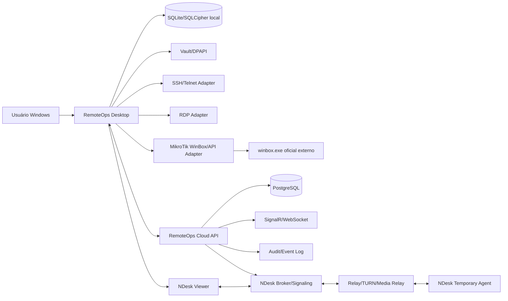
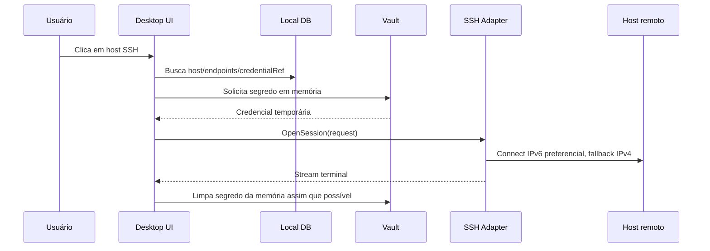
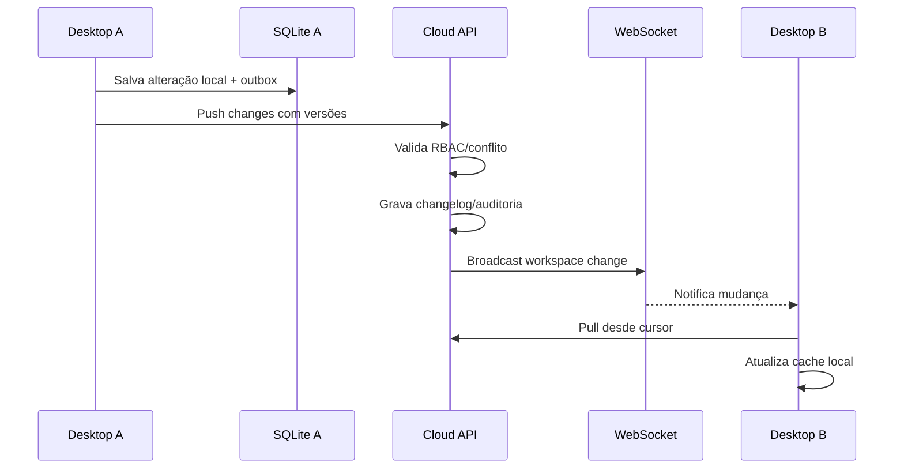
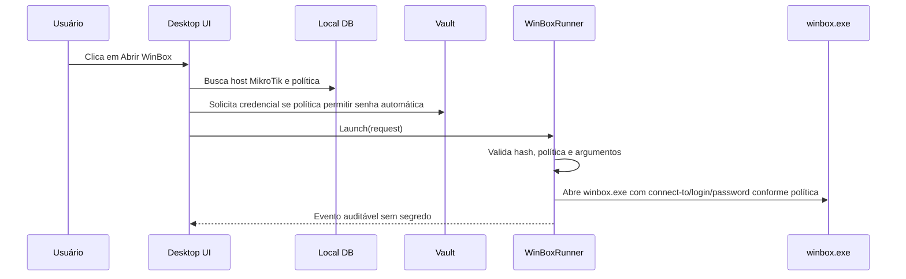
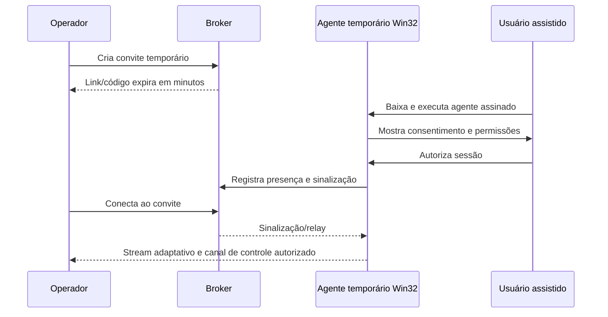

# 02 — Arquitetura geral

## Visão macro



## Componentes

### RemoteOps Desktop

Aplicativo Windows principal. Contém UI, navegação, abas, search, sessão local, armazenamento offline e adaptadores de protocolo.

Responsabilidades:

- Login do usuário.
- Cache local criptografado.
- Árvore de grupos/hosts.
- Abas SSH/Telnet/RDP/NDesk.
- Abertura de WinBox externo para hosts MikroTik.
- Viewer NDesk para operador.
- Sincronização com cloud.
- Auditoria local temporária quando offline.

### RemoteOps Cloud

Backend central para multiusuário e sincronização.

Responsabilidades:

- Autenticação/autorização.
- RBAC e tenants.
- Change log e sync cursors.
- Distribuição de eventos em tempo real.
- Auditoria central.
- Broker de assistência remota.
- Gestão de convites temporários.
- Coordenação de relay/TURN/media relay para NAT e conexão lenta.

### Storage local

Banco local criptografado para funcionamento offline.

Responsabilidades:

- Cache de inventário.
- Cache de metadados de credenciais.
- Outbox de mudanças locais.
- Inbox/cursor de mudanças remotas.
- Preferências locais.

### Vault/Credential layer

Camada que controla segredos.

Responsabilidades:

- Criptografar/descriptografar apenas em memória quando necessário.
- Proteger chaves locais com DPAPI.
- Não expor senha em UI ou logs.
- Permitir rotação e revogação.

### Adaptadores de protocolo

Todos os protocolos implementam uma interface comum.

```csharp
public interface IRemoteSessionProvider
{
    string Protocol { get; }
    Task<SessionHandle> OpenAsync(SessionRequest request, CancellationToken ct);
    Task CloseAsync(SessionHandle handle, CancellationToken ct);
}
```

Protocolos iniciais:

- SSH.
- Telnet.
- RDP.
- MikroTik WinBox externo, API-SSL/REST e SSH.
- NDesk Viewer/Agent/Relay.

## Fluxos principais

### Abrir sessão SSH



### Sincronização de mudança




### Abrir MikroTik via WinBox externo



### Convite NDesk



## Princípios de modularidade

- Cada protocolo é um plugin/adaptador isolado.
- Ferramentas externas como WinBox ficam atrás de runners auditáveis.
- UI não conhece detalhes de SSH/RDP/NDesk; usa interfaces.
- Credenciais passam por uma única camada de vault.
- Sync opera sobre objetos versionados, não sobre arquivos inteiros.
- Backend não precisa descriptografar segredos quando usar envelope encryption.
- Auditoria recebe eventos estruturados sem segredo.

## Modo offline-first

O desktop deve continuar abrindo hosts já sincronizados quando estiver offline, respeitando cache e políticas. Mudanças locais entram em outbox e serão sincronizadas depois. Em ambientes de alta segurança, o administrador pode configurar expiração de cache de credenciais.

## IPv6 preferencial

O resolvedor deve ordenar destinos assim:

1. IPv6 explícito do host.
2. AAAA do FQDN.
3. IPv4 explícito.
4. A do FQDN.

Deve existir fallback rápido para IPv4 quando IPv6 falhar.

## Pontos de extensão futura

- SFTP/SCP.
- VNC.
- HTTP/HTTPS admin links.
- SNMP inventory.
- Netconf/Restconf.
- Execução de playbooks controlados.
- Integração com ITSM/GLPI/Zabbix/LibreNMS/NetBox.


## Agente temporário NDesk separado

O agente temporário NDesk não deve herdar as dependências do Desktop principal. O Desktop pode usar .NET/WPF/WebView2; o agente baixado pelo cliente deve ser nativo, leve, assinado e compatível com Windows legado conforme `docs/22-ndesk-performance-legacy-windows.md`.

## Ferramentas externas governadas

Ferramentas empacotadas, como `winbox.exe`, devem ter manifesto, hash, versão aprovada e política de execução. O RemoteOps não deve confiar em binário externo sem validação quando ele for distribuído junto com o produto.
