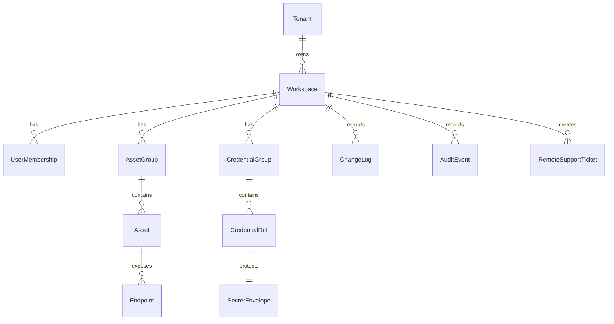

# 04 — Modelo de dados e sincronização

## Entidades principais



## Tabelas sugeridas

### tenants

- `id`
- `name`
- `status`
- `created_at`

### workspaces

- `id`
- `tenant_id`
- `name`
- `encryption_policy`
- `created_at`

### users

- `id`
- `email`
- `display_name`
- `status`
- `mfa_required`

### memberships

- `workspace_id`
- `user_id`
- `role`
- `permissions_json`

### asset_groups

- `id`
- `workspace_id`
- `parent_id`
- `name`
- `default_credential_ref_id`
- `version`
- `deleted_at`

### assets

- `id`
- `workspace_id`
- `group_id`
- `name`
- `vendor`
- `model`
- `site`
- `tags_json`
- `notes_encrypted`
- `version`
- `deleted_at`

### endpoints

- `id`
- `asset_id`
- `protocol`
- `fqdn`
- `ipv4`
- `ipv6`
- `port`
- `prefer_ipv6`
- `credential_ref_id`
- `profile_json`
- `version`

### credential_refs

- `id`
- `workspace_id`
- `name`
- `type`
- `scope`
- `owner_user_id`
- `credential_group_id`
- `metadata_json`
- `secret_envelope_id`
- `version`
- `deleted_at`

### secret_envelopes

- `id`
- `workspace_id`
- `ciphertext`
- `nonce`
- `algorithm`
- `key_version`
- `created_by`
- `rotated_at`

### changelog

- `id`
- `workspace_id`
- `entity_type`
- `entity_id`
- `operation`
- `version`
- `patch_json`
- `actor_user_id`
- `created_at`

### audit_events

- `id`
- `workspace_id`
- `actor_user_id`
- `action`
- `target_type`
- `target_id`
- `ip_address`
- `device_id`
- `metadata_json_sanitized`
- `created_at`

## Modelo offline-first

Cada cliente mantém:

- `local_entities`: cache de objetos.
- `local_outbox`: mudanças geradas offline ou ainda não confirmadas.
- `sync_cursor`: último changelog aplicado.
- `conflicts`: conflitos pendentes.

## Algoritmo de sync

### Pull

1. Cliente envia `workspace_id` e `cursor`.
2. Servidor retorna mudanças ordenadas por `changelog.id`.
3. Cliente aplica patches idempotentes.
4. Cliente atualiza cursor.

### Push

1. Cliente envia lote de mudanças com `base_version`.
2. Servidor valida RBAC.
3. Servidor compara `base_version` com versão atual.
4. Se não houver conflito, aplica e grava changelog.
5. Se houver conflito, retorna conflito para resolução.

## Estratégia de conflito

| Entidade | Estratégia |
|---|---|
| Asset/Endpoint | Field-level merge quando possível; senão conflito manual |
| CredentialRef metadata | Last writer wins com auditoria |
| SecretEnvelope | Nunca merge automático; nova versão vence apenas com permissão |
| Permission/RBAC | Servidor é autoridade |
| Groups | Merge por versão; conflito manual em movimento/rename simultâneo |
| Preferências locais | Não sincronizar ou sincronizar por usuário |

## Realtime

SignalR/WebSocket deve notificar clientes conectados:

```json
{
  "type": "workspace.changed",
  "workspaceId": "...",
  "fromChangeId": 12345,
  "hint": "asset.updated"
}
```

O cliente não deve confiar no payload do WebSocket como fonte completa. Ele deve usar a notificação para acionar Pull.

## Segurança do sync

- Servidor não deve logar payload de segredo.
- Changelog de segredos deve registrar metadados, não plaintext.
- Todo Push exige autenticação e permissão.
- Mudanças sensíveis podem entrar em fluxo de aprovação.
- Cliente deve verificar assinatura/integridade do pacote quando adotado.

## Performance

- Paginar Pull.
- Compactar changelog antigo em snapshots por workspace.
- Indexar `workspace_id`, `entity_id`, `changelog.id`, `updated_at`.
- Usar backoff exponencial em falhas.
- Evitar sync de terminal logs por padrão.
