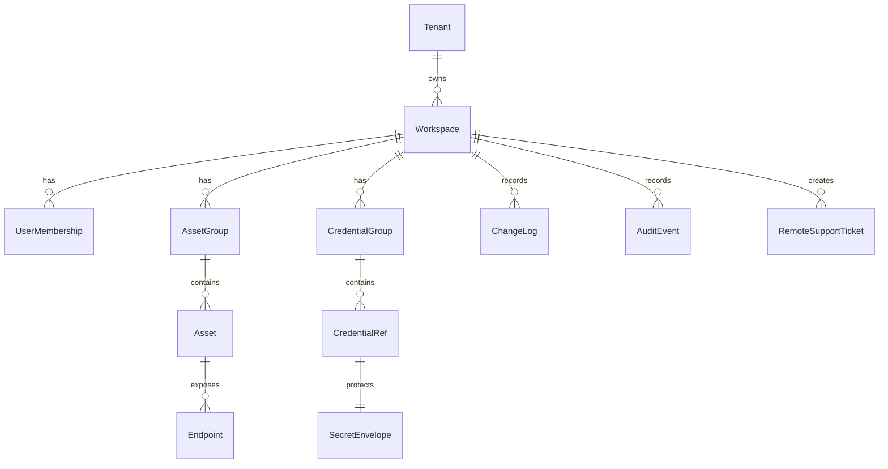

# 04 — Modelo de dados e sincronização

## Entidades principais



## Tabelas sugeridas

### tenants

- `id`
- `name`
- `status`
- `created_at`

### workspaces

- `id`
- `tenant_id`
- `name`
- `encryption_policy`
- `created_at`

### users

- `id`
- `email`
- `display_name`
- `status`
- `mfa_required`

### memberships

- `workspace_id`
- `user_id`
- `role`
- `permissions_json`

### asset_groups

- `id`
- `workspace_id`
- `parent_id`
- `name`
- `default_credential_ref_id`
- `version`
- `deleted_at`

### assets

- `id`
- `workspace_id`
- `group_id`
- `name`
- `vendor`
- `model`
- `site`
- `tags_json`
- `notes_encrypted`
- `version`
- `deleted_at`

### endpoints

- `id`
- `asset_id`
- `protocol`
- `fqdn`
- `ipv4`
- `ipv6`
- `port`
- `prefer_ipv6`
- `credential_ref_id`
- `profile_json`
- `version`

### credential_refs

- `id`
- `workspace_id`
- `name`
- `type`
- `scope`
- `owner_user_id`
- `credential_group_id`
- `metadata_json`
- `secret_envelope_id`
- `version`
- `deleted_at`

### secret_envelopes

- `id`
- `workspace_id`
- `ciphertext`
- `nonce`
- `algorithm`
- `key_version`
- `created_by`
- `rotated_at`

### changelog

- `id`
- `workspace_id`
- `entity_type`
- `entity_id`
- `operation`
- `version`
- `patch_json`
- `actor_user_id`
- `created_at`

### audit_events

- `id`
- `workspace_id`
- `actor_user_id`
- `action`
- `target_type`
- `target_id`
- `ip_address`
- `device_id`
- `metadata_json_sanitized`
- `created_at`

## Modelo offline-first

Cada cliente mantém:

- `local_entities`: cache de objetos.
- `local_outbox`: mudanças geradas offline ou ainda não confirmadas.
- `sync_cursor`: último changelog aplicado.
- `conflicts`: conflitos pendentes.

### Schema local (implementado em `feature/sync-local` e `feature/integration-storage`)

Banco SQLite/SQLCipher (ADR-008); chave protegida por vault DPAPI/envelope (ADR-003).

```sql
CREATE TABLE local_outbox (
    id               INTEGER PRIMARY KEY AUTOINCREMENT,
    client_change_id TEXT,                          -- null = sem idempotência
    entity_type      TEXT    NOT NULL,
    entity_id        TEXT    NOT NULL,
    operation        TEXT    NOT NULL
                              CHECK (operation IN ('created', 'updated', 'deleted')),
    base_version     INTEGER NOT NULL DEFAULT 0,
    patch_json       TEXT    NOT NULL,              -- JSON do Patch de SyncChange
    created_at       TEXT    NOT NULL,
    UNIQUE (client_change_id)                       -- idempotência por ClientChangeId
);

CREATE INDEX idx_outbox_entity ON local_outbox (entity_id, entity_type);

CREATE TABLE local_entities (
    entity_type TEXT    NOT NULL,
    entity_id   TEXT    NOT NULL,
    version     INTEGER NOT NULL DEFAULT 0,
    data_json   TEXT    NOT NULL,
    updated_at  TEXT    NOT NULL,
    PRIMARY KEY (entity_type, entity_id)
);

CREATE TABLE sync_cursor (
    workspace_id TEXT    NOT NULL PRIMARY KEY,
    cursor       INTEGER NOT NULL DEFAULT 0
);

CREATE TABLE conflicts (
    id                 INTEGER PRIMARY KEY AUTOINCREMENT,
    entity_type        TEXT    NOT NULL,
    entity_id          TEXT    NOT NULL,
    local_patch_json   TEXT    NOT NULL,
    server_patch_json  TEXT    NOT NULL,
    detected_at        TEXT    NOT NULL
);
```

```sql
-- Tabelas de entidades locais (SqlCipherLocalStore, feature/integration-storage)
CREATE TABLE IF NOT EXISTS asset_groups (
    id                        TEXT PRIMARY KEY,
    workspace_id              TEXT NOT NULL,
    parent_id                 TEXT,
    name                      TEXT NOT NULL,
    default_credential_ref_id TEXT,
    version                   INTEGER NOT NULL DEFAULT 0
);

CREATE TABLE IF NOT EXISTS assets (
    id           TEXT PRIMARY KEY,
    workspace_id TEXT NOT NULL,
    group_id     TEXT,
    name         TEXT NOT NULL,
    vendor       TEXT,
    model        TEXT,
    site         TEXT,
    tags_json    TEXT NOT NULL DEFAULT '[]',
    version      INTEGER NOT NULL DEFAULT 0
);

CREATE TABLE IF NOT EXISTS endpoints (
    id                TEXT PRIMARY KEY,
    asset_id          TEXT NOT NULL,
    protocol          TEXT NOT NULL,
    fqdn              TEXT,
    ipv4              TEXT,
    ipv6              TEXT,
    port              INTEGER NOT NULL DEFAULT 0,
    prefer_ipv6       INTEGER NOT NULL DEFAULT 1,
    credential_ref_id TEXT,
    profile_json      TEXT,
    version           INTEGER NOT NULL DEFAULT 0
);

CREATE TABLE IF NOT EXISTS credential_refs (
    id                 TEXT PRIMARY KEY,
    name               TEXT NOT NULL,
    type               TEXT NOT NULL,
    scope              TEXT,           -- workspaceId ou NULL (global)
    metadata_json      TEXT,
    secret_envelope_id TEXT,           -- referência ao envelope; nunca o segredo
    version            INTEGER NOT NULL DEFAULT 0
);
```

Todas as tabelas de entidades ficam no mesmo arquivo `sync-{workspaceId}.db` que as tabelas de outbox acima,
compartilhando a chave AES-256 derivada pelo vault. Toda mutação nas tabelas de entidades também grava no
`local_outbox` via `ISyncClient.PushAsync` (outbox pattern — INT-5 sincroniza com o cloud).

**Cursor monotônico**: `local_outbox.id` (AUTOINCREMENT) serve como cursor de Pull.
`ISyncClient.PullAsync(fromCursor, limit)` retorna linhas com `id > fromCursor`, ordenadas
por `id ASC`, e atualiza `CurrentCursor` ao máximo lido.

### Cliente de sincronização remoto (INT-5, ADR-013)

O cliente de sync (`RemoteOps.Sync/Remote`) adiciona, por migração **aditiva e idempotente**
(`ALTER TABLE ... ADD COLUMN` guardado por `PRAGMA table_info`):

```sql
-- cursor do outbox já confirmado pelo servidor (além do cursor do servidor já existente)
ALTER TABLE sync_cursor ADD COLUMN outbox_cursor INTEGER NOT NULL DEFAULT 0;

-- detalhes do ConflictDetail devolvido pelo servidor (sem segredo nem patch)
ALTER TABLE conflicts ADD COLUMN client_change_id TEXT;
ALTER TABLE conflicts ADD COLUMN base_version     INTEGER;
ALTER TABLE conflicts ADD COLUMN current_version  INTEGER;
ALTER TABLE conflicts ADD COLUMN reason           TEXT;
```

- `sync_cursor.cursor` = último `changelog.id` do servidor aplicado; `sync_cursor.outbox_cursor`
  = último `local_outbox.id` confirmado no push.
- `conflicts` passa a guardar o `ConflictDetail`; as colunas legadas `local_patch_json`/
  `server_patch_json` recebem `'{}'` quando a origem é um conflito do servidor.
- O **applier** (`LocalEntitiesChangeApplier`) aplica as mudanças puxadas em `local_entities` de
  forma idempotente/monotônica (UPSERT com guarda `version >=`) e **sem** re-emitir no outbox.
- `SecretEnvelope` nunca sofre auto-merge no cliente (espelha `secret-envelope.no-auto-merge`).

## Algoritmo de sync

### Pull

1. Cliente envia `workspace_id` e `cursor`.
2. Servidor retorna mudanças ordenadas por `changelog.id`.
3. Cliente aplica patches idempotentes.
4. Cliente atualiza cursor.

### Push

1. Cliente envia lote de mudanças com `base_version`.
2. Servidor valida RBAC.
3. Servidor compara `base_version` com versão atual.
4. Se não houver conflito, aplica e grava changelog.
5. Se houver conflito, retorna conflito para resolução.

## Estratégia de conflito

| Entidade | Estratégia |
|---|---|
| Asset/Endpoint | Field-level merge quando possível; senão conflito manual |
| CredentialRef metadata | Last writer wins com auditoria |
| SecretEnvelope | Nunca merge automático; nova versão vence apenas com permissão |
| Permission/RBAC | Servidor é autoridade |
| Groups | Merge por versão; conflito manual em movimento/rename simultâneo |
| Preferências locais | Não sincronizar ou sincronizar por usuário |

## Realtime

SignalR/WebSocket deve notificar clientes conectados:

```json
{
  "type": "workspace.changed",
  "workspaceId": "...",
  "fromChangeId": 12345,
  "hint": "asset.updated"
}
```

O cliente não deve confiar no payload do WebSocket como fonte completa. Ele deve usar a notificação para acionar Pull.

## Segurança do sync

- Servidor não deve logar payload de segredo.
- Changelog de segredos deve registrar metadados, não plaintext.
- Todo Push exige autenticação e permissão.
- Mudanças sensíveis podem entrar em fluxo de aprovação.
- Cliente deve verificar assinatura/integridade do pacote quando adotado.

## Performance

- Paginar Pull.
- Compactar changelog antigo em snapshots por workspace.
- Indexar `workspace_id`, `entity_id`, `changelog.id`, `updated_at`.
- Usar backoff exponencial em falhas.
- Evitar sync de terminal logs por padrão.
