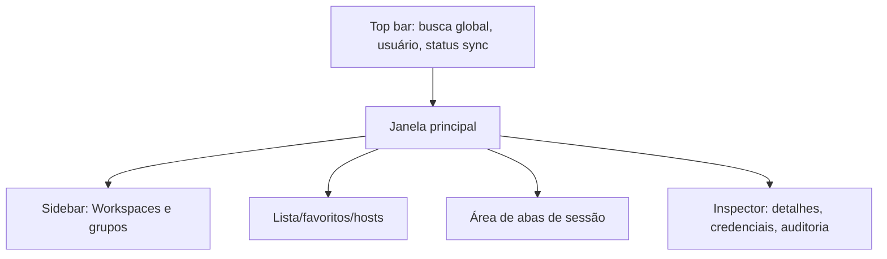

# 06 — Desktop UI/UX

## Objetivo

Criar uma interface Windows para operadores acessarem rapidamente infraestrutura sem precisar manter cadastros separados em várias ferramentas.

## Layout principal

## Elementos principais

### Sidebar

- Workspaces.
- Árvore de grupos.
- Favoritos.
- Filtros por protocolo.
- Filtros por fornecedor.

### Busca global

Deve buscar por:

- Nome do host.
- IPv4/IPv6.
- FQDN.
- Tag.
- Grupo.
- Fornecedor/modelo.
- Observações permitidas.

### Lista de hosts

Colunas sugeridas:

- Nome.
- Status conhecido.
- Protocolo principal.
- IP/FQDN.
- Grupo.
- Credencial herdada/própria.
- Tags.
- Última alteração.

### Abas

Tipos de aba:

- SSH.
- Telnet.
- RDP.
- MikroTik details.
- NDesk session.
- Logs/auditoria.

Recursos:

- Renomear aba.
- Fixar aba.
- Duplicar sessão.
- Destacar em janela separada.
- Fechar todas do grupo.

### Inspector

Mostra detalhes do host e ações rápidas:

- Abrir SSH.
- Abrir Telnet.
- Abrir RDP.
- Abrir API MikroTik.
- Copiar IP/FQDN.
- Ver auditoria.
- Editar, se tiver permissão.

## UX de credenciais

- Mostrar nome da credencial, nunca senha.
- Indicar se é herdada do grupo.
- Indicar se há override no host.
- Botão “testar credencial” sem revelar senha.
- Ação “revelar senha” deve ser desabilitada por padrão e, se habilitada, exigir permissão especial e auditoria.

## UX de sync

Status no topo:

- Online/sincronizado.
- Sincronizando.
- Offline com alterações pendentes.
- Conflito pendente.
- Erro de autenticação.

## UX de conflito

Conflitos devem ser raros e claros:

- Mostrar versão local e remota.
- Mostrar campos em conflito.
- Permitir manter local, aceitar remoto ou editar manualmente.
- Segredos não devem ser exibidos; conflito de segredo deve exigir rotação ou escolha de versão metadata.

## UX NDesk

Tela do operador:

- Criar convite.
- Copiar link.
- Ver expiração.
- Aguardar cliente.
- Solicitar visualização.
- Solicitar controle.
- Encerrar sessão.

Tela do usuário assistido:

- Nome da empresa/operador.
- Permissões solicitadas.
- Botão autorizar.
- Botão negar.
- Botão encerrar sempre visível.
- Banner permanente durante sessão.

## Acessibilidade e produtividade

- Atalhos de teclado.
- Busca fuzzy.
- Favoritos por usuário.
- Tema claro/escuro.
- Tamanho de fonte do terminal.
- Histórico local de sessões, sem gravar conteúdo sensível por padrão.

## Tecnologia UI

- WPF + MVVM.
- WebView2 para terminal xterm.js.
- WindowsFormsHost para RDP ActiveX.
- Shell modular por regiões: sidebar, list, tabs, inspector.
- Comandos assíncronos com cancelamento.
