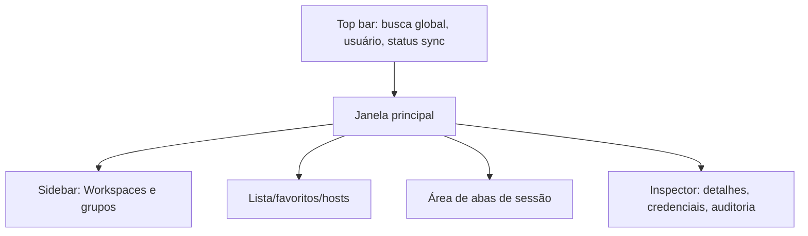

# 06 — Desktop UI/UX

## Objetivo

Criar uma interface Windows para operadores acessarem rapidamente infraestrutura sem precisar manter cadastros separados em várias ferramentas.

## Layout principal

## Elementos principais

### Sidebar

- Workspaces.
- Árvore de grupos.
- Favoritos.
- Filtros por protocolo.
- Filtros por fornecedor.

### Busca global

Deve buscar por:

- Nome do host.
- IPv4/IPv6.
- FQDN.
- Tag.
- Grupo.
- Fornecedor/modelo.
- Observações permitidas.

### Lista de hosts

Colunas sugeridas:

- Nome.
- Status conhecido.
- Protocolo principal.
- IP/FQDN.
- Grupo.
- Credencial herdada/própria.
- Tags.
- Última alteração.

### Abas

Tipos de aba:

- SSH.
- Telnet.
- RDP.
- MikroTik details.
- NDesk session.
- Logs/auditoria.

Recursos:

- Renomear aba.
- Fixar aba.
- Duplicar sessão.
- Destacar em janela separada.
- Fechar todas do grupo.

### Inspector

Mostra detalhes do host e ações rápidas:

- Abrir SSH.
- Abrir Telnet.
- Abrir RDP.
- Abrir API MikroTik.
- Copiar IP/FQDN.
- Ver auditoria.
- Editar, se tiver permissão.

## UX de credenciais

- Mostrar nome da credencial, nunca senha.
- Indicar se é herdada do grupo.
- Indicar se há override no host.
- Botão “testar credencial” sem revelar senha.
- Ação “revelar senha” deve ser desabilitada por padrão e, se habilitada, exigir permissão especial e auditoria.

## UX de sync

Status no topo:

- Online/sincronizado.
- Sincronizando.
- Offline com alterações pendentes.
- Conflito pendente.
- Erro de autenticação.

## UX de conflito

Conflitos devem ser raros e claros:

- Mostrar versão local e remota.
- Mostrar campos em conflito.
- Permitir manter local, aceitar remoto ou editar manualmente.
- Segredos não devem ser exibidos; conflito de segredo deve exigir rotação ou escolha de versão metadata.

## UX NDesk

Tela do operador:

- Criar convite.
- Copiar link.
- Ver expiração.
- Aguardar cliente.
- Solicitar visualização.
- Solicitar controle.
- Encerrar sessão.

Tela do usuário assistido:

- Nome da empresa/operador.
- Permissões solicitadas.
- Botão autorizar.
- Botão negar.
- Botão encerrar sempre visível.
- Banner permanente durante sessão.

## Acessibilidade e produtividade

- Atalhos de teclado.
- Busca fuzzy.
- Favoritos por usuário.
- Tema claro/escuro (escuro implementado; claro pendente — ver §Sistema de design).
- Tamanho de fonte do terminal.
- Histórico local de sessões, sem gravar conteúdo sensível por padrão.

## Sistema de design

Tema escuro base implementado em `src/RemoteOps.Desktop/Themes/` — ResourceDictionaries puras do
WPF, sem toolkit de terceiro. Aplicado ao shell inteiro (barra superior, sidebar, lista de hosts,
abas, inspector) e às três abas de sessão (Terminal, RDP, NDesk), substituindo as cores hex soltas
que existiam espalhadas pelas Views — que produziam uma UI inconsistente (sidebar/lista/inspector
claros ao lado de abas escuras). Nenhum ViewModel ou code-behind foi alterado; só XAML/recursos.

### Estrutura

- `Themes/Tokens/Colors.xaml` — paleta "Slate Signal": fundos slate-azulados (não neutros, não
  preto puro), accent ciano-sinal, e cores de status (online/pendente/erro/idle) que mapeiam
  estados que já existem nos ViewModels (`SyncStatus`, `NDeskSessionState`, `WinBoxError`) — a cor
  carrega significado, não é decoração. Também sobrescreve as chaves `SystemColors.*BrushKey`
  usadas internamente pelos templates padrão do WPF, como rede de segurança para qualquer parte de
  controle não retemplada explicitamente.
- `Themes/Tokens/Typography.xaml` — família base "Segoe UI Variable Text" com fallback "Segoe UI"
  (garantida em qualquer Windows 10/11); família mono "Consolas" para dados técnicos (IP/FQDN/tags),
  convenção de console de operação.
- `Themes/Tokens/Spacing.xaml` — escala de 4px e raio de canto único (4px controles / 6px
  superfícies), casando com as margens já usadas nas Views.
- `Themes/Tokens/Icons.xaml` — ver §Ícones abaixo.
- `Themes/Controls/*.xaml` — estilos/templates de Button, TextBox, ComboBox, TabControl/TabItem,
  DataGrid, TreeView/TreeViewItem, ScrollBar, Separator, ToolTip.
- `Themes/DarkTheme.xaml` — agregador mesclado em `App.xaml` (único ponto de mesclagem; dono do
  merge é o `desktop-shell-agent`, `App.xaml.cs` não foi tocado).

Views consomem os tokens via `DynamicResource` (não `StaticResource`) deliberadamente — mantém a
porta aberta para um tema claro futuro sem precisar tocar nenhum binding depois; hoje só o tema
escuro existe (ver §Debitado).

### Elemento de assinatura: trilha de sinal

Um único padrão visual — indicador de cor semântica (ponto ou selo) — se repete em todo lugar que
já expõe estado de conexão/sessão: o ponto de sync na barra superior (`MainViewModel.SyncStatus`),
o rótulo de Estado nos dois lados do painel NDesk (`NDeskSessionState`), e os selos de protocolo
nas abas de sessão. Mesma paleta em todo lugar — verde = conectado, âmbar = pendente/aguardando
consentimento, vermelho = erro, cinza = idle — lida via `DataTrigger` sobre bindings que já
existiam; nenhum ViewModel foi alterado para isso.

### Ícones

Fonte de sistema **Segoe MDL2 Assets** (glifos via `FontFamily` + code point Unicode), não um
pacote de ícones SVG/TTF de terceiro embarcado no app. Verificado em duas páginas oficiais da
Microsoft Learn antes de adotar — mesma disciplina de fonte primária já usada em `ADR-015`/`ADR-017`
para descartar SIPSorcery/RustDesk por licença:

- [Segoe MDL2 Assets](https://learn.microsoft.com/en-us/windows/apps/design/style/segoe-ui-symbol-font):
  pré-instalada desde o lançamento do Windows 10, mantida no Windows 11 para retrocompatibilidade —
  sem download separado, sem redistribuição, sem EULA restritiva para uso via `FontFamily` em app
  desktop.
- [Segoe Fluent Icons](https://learn.microsoft.com/en-us/windows/apps/design/style/segoe-fluent-icons-font):
  **descartada** para este app — só vem pré-instalada no Windows 11; no Windows 10 exige download
  separado, e a doc oficial afirma que a fonte pode ser baixada para uso em design/desenvolvimento
  mas não pode ser reembarcada/redistribuída para outra plataforma. Como o alvo é Windows 10 **e**
  11 (CLAUDE.md), MDL2 Assets é a opção sem risco de licença nem passo de instalação extra.

Code points usados hoje (conferidos contra a tabela oficial de glifos, não reaproveitados de
memória): Add `E710`, Delete `E74D`, Search `E721`, Cancel `E711`, CheckMark `E73E`, Shield `EA18`,
Connect `E703`, TVMonitor `E7F4`, NetworkTower `EC05`, ChevronDown `E70D`, ChevronRight `E76C`,
Sync `E895`, Warning `E7BA`, ErrorBadge `EA39`, Pin `E718`, ChromeClose `E8BB`. Cobertura hoje:
ações rápidas do Inspector (SSH/Telnet/RDP/WinBox), selos de protocolo das abas, indicador de aba
fixada, aviso de erro do WinBox, banner de sessão NDesk — deliberadamente conservadora, só onde o
glifo carrega significado real. Ao adicionar um ícone novo, conferir o code point na tabela oficial
antes de usar — não adivinhar a partir de memória.

### Decisão: estilo próprio, sem toolkit de terceiro

Avaliado e **não adotado**: WPF-UI/Fluent, MahApps.Metro, HandyControl. A decisão foi de
escopo/risco antes mesmo de chegar a uma investigação de licença: o app já tinha praticamente todos
os controles necessários (Button, TextBox, ComboBox, DataGrid, TreeView, TabControl), só precisando
de retema visual — não de controles novos. Um toolkit inteiro traria superfície de dependência
(build, atualizações, licença para revisar a cada bump) desproporcional ao ganho, quando
`ResourceDictionary`/`Style`/`ControlTemplate` puros do WPF já cobrem o pedido. Por não ser
dependência de terceiro, esta escolha não abre ADR (regra do prompt de sprint: ADR só é obrigatória
se um toolkit de terceiro for adotado).

**Alternativa também considerada e descartada:** o tema Fluent nativo do WPF
(`Application.ThemeMode="Dark"`, disponível desde o .NET 9, embutido no próprio
`PresentationFramework` — não é pacote NuGet de terceiro). Daria cobertura de tema em praticamente
todo controle padrão de graça. Descartado por ora porque a própria documentação oficial
(`dotnet/wpf`, `using-fluent.md`) descreve o recurso como experimental, cita várias lacunas nos
estilos ainda a resolver no .NET 10 e alerta para possíveis mudanças quebrantadas em versões
futuras — risco alto demais para um app que abre sessões administrativas e credenciadas, e sem como
testar visualmente o resultado neste ambiente de desenvolvimento. Revisitar quando o recurso sair
de experimental.

### Debitado / próximos passos

- Tema claro ainda não existe — só a estrutura (`DynamicResource`) está pronta para receber um
  `Themes/LightTheme.xaml` equivalente no futuro.
- `ThemeMode` Fluent nativo do WPF fica para reavaliação quando estabilizar (ver decisão acima).
- Foco de teclado customizado (além do `BorderBrush` de foco em Button/TextBox) e navegação por
  teclado completa na TreeView/DataGrid não foram auditados nesta frente.

## Tecnologia UI

- WPF + MVVM.
- WebView2 para terminal xterm.js.
- WindowsFormsHost para RDP ActiveX.
- Shell modular por regiões: sidebar, list, tabs, inspector.
- Comandos assíncronos com cancelamento.
