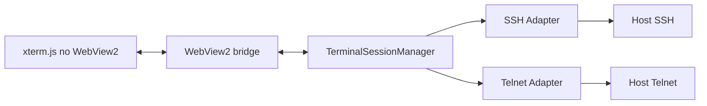

# 07 — Módulo SSH, Telnet e MikroTik

## Objetivo

Construir o módulo estilo PuTTY/MobaXterm para abrir e gerenciar múltiplas sessões SSH/Telnet em abas, com grupos, credenciais compartilhadas, perfis por fornecedor e integração prática com MikroTik via WinBox oficial externo.

## Escopo SSH/Telnet

### MVP

- Abrir sessão SSH interativa.
- Abrir sessão Telnet interativa.
- Terminal xterm.js em aba.
- Autenticação por senha.
- Autenticação por chave privada SSH.
- Porta customizada.
- IPv6 preferencial com fallback IPv4.
- Keepalive.
- Perfis de terminal.
- Log de início/fim da sessão sem conteúdo do terminal.

### Pós-MVP

- SFTP/SCP.
- Port forwarding SSH controlado.
- Jump host/bastion.
- Execução de comandos em lote com aprovação.
- Macro segura por fornecedor.
- Gravação opcional de sessão com política.

## Arquitetura do terminal



## Contrato de sessão

```json
{
  "sessionId": "ulid",
  "protocol": "ssh",
  "host": "router01.example.local",
  "port": 22,
  "preferIpv6": true,
  "terminal": {
    "cols": 120,
    "rows": 32,
    "encoding": "utf-8"
  },
  "credentialRefId": "..."
}
```

## Perfis por fornecedor

### Cisco IOS/NX-OS

- Prompt detection opcional.
- Comando de paging: `terminal length 0` quando autorizado.
- Encoding padrão UTF-8/ASCII.

### Huawei VRP

- Comando de paging: `screen-length 0 temporary` quando autorizado.
- Prompt com `<name>` ou `[name]`.

### Juniper Junos

- Comando de paging: `set cli screen-length 0` quando autorizado.
- Modo operational/configuration.

### MikroTik RouterOS

- Botão primário `Abrir WinBox` usando WinBox oficial externo.
- Terminal SSH para CLI.
- RouterOS API-SSL/REST para UI estruturada futura.
- Cuidado com diferenças RouterOS v6/v7.

### ZTE/OLT/FiberHome/outros

- Perfis configuráveis.
- Não assumir prompt fixo.
- Permitir templates por cliente.

## Telnet

Telnet deve ser tratado como legado e menos seguro:

- Desabilitado por padrão em novas políticas.
- Exibir aviso visual quando abrir.
- Permitir apenas para grupos autorizados.
- Auditar uso.

## MikroTik

### Estratégia do MVP

Usar o WinBox oficial externo como caminho principal para MikroTik:

1. O RemoteOps cadastra host, grupo, cliente, tags, IPv4/IPv6, porta, usuário e credencial.
2. O usuário clica em `Abrir WinBox`.
3. O `WinBoxRunner` valida política, executável, hash e permissão.
4. O runner chama `winbox.exe` com destino e credenciais conforme política.
5. O evento é auditado sem registrar senha.

Essa abordagem reduz escopo, evita engenharia reversa do protocolo WinBox e entrega uma experiência familiar para quem já usa MikroTik.

### Estratégia pós-MVP

- RouterOS API-SSL para consultas estruturadas.
- REST API em RouterOS v7 quando habilitada.
- SSH para terminal, backup, scripts e automações aprovadas.
- Dashboard próprio para inventário, interfaces, DHCP, PPPoE, rotas e logs.

### WinBox Runner

Detalhado em `docs/21-mikrotik-winbox-runner.md`.

Requisitos mínimos:

- suportar IPv4;
- suportar IPv6 com colchetes;
- suportar porta customizada;
- suportar usuário;
- suportar senha automática somente por política;
- suportar senha vazia;
- suportar workspace/sessão opcional;
- suportar RoMON em spike;
- validar hash do executável quando empacotado;
- não logar argumentos sensíveis.

### Telas MikroTik futuras

- Identidade, versão e recursos.
- Interfaces.
- IP addresses.
- Rotas.
- DHCP leases.
- PPP/PPPoE active sessions, se aplicável.
- Logs recentes.
- Serviços habilitados.

## Segurança

- Validar host key SSH e registrar exceção auditada.
- Não aceitar automaticamente host key alterada.
- Não logar terminal input/output por padrão.
- Não exibir senha.
- Macros/comandos iniciais devem ser opt-in por perfil/grupo.
- Para WinBox, tratar senha em argumento de processo como risco controlado por política.
- Nunca usar `winbox.cfg` como cofre primário do produto.

## Critérios de aceite MVP

- Abrir 10 sessões SSH simultâneas em abas sem travar UI.
- Abrir Telnet quando permitido por política.
- Resizing do terminal ajusta PTY remoto.
- Copiar/colar funciona conforme política.
- Host key nova/alterada tem fluxo de confirmação.
- Credencial de grupo funciona e é auditada.
- IPv6 é tentado antes de IPv4 quando configurado.
- Host MikroTik abre WinBox externo com IP, porta e usuário.
- Senha automática no WinBox só funciona se a política permitir.
- WinBox com IPv6 usa formato correto com colchetes.
