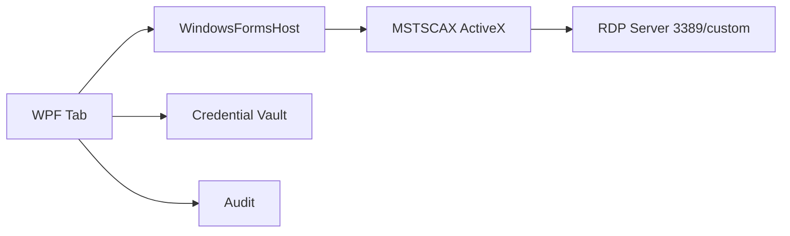

# 08 — Módulo RDP / Terminal Server

## Objetivo

Permitir gerenciar e abrir múltiplas conexões RDP/Terminal Server em abas, com credenciais salvas por host ou grupo.

## Decisão inicial

Usar o controle Microsoft Remote Desktop ActiveX/MSTSCAX hospedado no desktop WPF por interop com Windows Forms.

## Alternativas

### MSTSCAX/ActiveX

Vantagens:

- Usa stack Microsoft.
- Suporta NLA, redirecionamentos e recursos do cliente Windows.
- Menor risco de incompatibilidade com servidores Windows.

Riscos:

- ActiveX/COM é legado.
- Hospedagem em WPF exige interop.
- Pode haver limitações visuais com abas/redimensionamento.

### FreeRDP

Vantagens:

- Open source.
- Mais controle sobre pipeline.
- Pode facilitar futuro cross-platform.

Riscos:

- Integração Windows UI e credenciais pode exigir mais trabalho.
- Compatibilidade com recursos Microsoft específicos precisa validação.

## Arquitetura

## Campos por endpoint RDP

- Host/FQDN/IP.
- Porta, padrão 3389.
- Domínio.
- Usuário.
- CredentialRef.
- Resolução.
- Fullscreen/windowed.
- NLA required.
- Cert policy.
- Clipboard redirect.
- Drive redirect.
- Printer redirect.
- Audio redirect.
- Gateway/RD Gateway futuro.

## Políticas recomendadas

- Clipboard permitido por padrão somente em grupos autorizados.
- Drive redirection desabilitado por padrão.
- Printer redirection desabilitado por padrão.
- Certificado inválido exige confirmação auditada.
- Salvar credenciais no Windows Credential Manager apenas se política permitir; preferir vault interno.

## Fluxo de abertura

1. Usuário seleciona endpoint RDP.
2. UI verifica permissão `session.rdp.open`.
3. Vault libera credencial em memória.
4. Adapter configura ActiveX.
5. Conexão é aberta.
6. Auditoria registra início.
7. Ao desconectar, auditoria registra fim e código.

## Critérios de aceite MVP

- Abrir RDP em aba.
- Porta customizada funciona.
- Credencial por grupo e por host funciona.
- Redimensionamento da aba não quebra sessão.
- Desconexão gera evento e status.
- NLA funciona contra Windows Server moderno.
- Política de clipboard/drive é respeitada.

## Spikes obrigatórios

- `SPIKE-RDP-001`: WPF + WindowsFormsHost + MSTSCAX em aba.
- `SPIKE-RDP-002`: eventos de conexão/desconexão/certificado.
- `SPIKE-RDP-003`: compatibilidade com Windows 10/11 e Windows Server em laboratório.
- `SPIKE-RDP-004`: comparação FreeRDP mínima.
