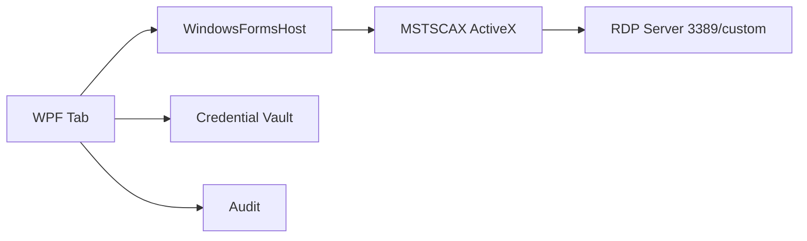

# 08 — Módulo RDP / Terminal Server

## Objetivo

Permitir gerenciar e abrir múltiplas conexões RDP/Terminal Server em abas, com credenciais salvas por host ou grupo.

## Decisão inicial

Usar o controle Microsoft Remote Desktop ActiveX/MSTSCAX hospedado no desktop WPF por interop com Windows Forms.

## Alternativas

### MSTSCAX/ActiveX

Vantagens:

- Usa stack Microsoft.
- Suporta NLA, redirecionamentos e recursos do cliente Windows.
- Menor risco de incompatibilidade com servidores Windows.

Riscos:

- ActiveX/COM é legado.
- Hospedagem em WPF exige interop.
- Pode haver limitações visuais com abas/redimensionamento.

### FreeRDP

Vantagens:

- Open source.
- Mais controle sobre pipeline.
- Pode facilitar futuro cross-platform.

Riscos:

- Integração Windows UI e credenciais pode exigir mais trabalho.
- Compatibilidade com recursos Microsoft específicos precisa validação.

## Arquitetura

## Campos por endpoint RDP

- Host/FQDN/IP.
- Porta, padrão 3389.
- Domínio.
- Usuário.
- CredentialRef.
- Resolução.
- Fullscreen/windowed.
- NLA required.
- Cert policy.
- Clipboard redirect.
- Drive redirect.
- Printer redirect.
- Audio redirect.
- Gateway/RD Gateway futuro.

## Políticas recomendadas

- Clipboard permitido por padrão somente em grupos autorizados.
- Drive redirection desabilitado por padrão.
- Printer redirection desabilitado por padrão.
- Certificado inválido exige confirmação auditada.
- Salvar credenciais no Windows Credential Manager apenas se política permitir; preferir vault interno.

## Fluxo de abertura

1. Usuário seleciona endpoint RDP.
2. UI verifica permissão `session.rdp.open`.
3. Vault libera credencial em memória.
4. Adapter configura ActiveX.
5. Conexão é aberta.
6. Auditoria registra início.
7. Ao desconectar, auditoria registra fim e código.

## Critérios de aceite MVP

- Abrir RDP em aba.
- Porta customizada funciona.
- Credencial por grupo e por host funciona.
- Redimensionamento da aba não quebra sessão.
- Desconexão gera evento e status.
- NLA funciona contra Windows Server moderno.
- Política de clipboard/drive é respeitada.

## Spikes obrigatórios

- `SPIKE-RDP-001`: WPF + WindowsFormsHost + MSTSCAX em aba.
- `SPIKE-RDP-002`: eventos de conexão/desconexão/certificado.
- `SPIKE-RDP-003`: compatibilidade com Windows 10/11 e Windows Server em laboratório.
- `SPIKE-RDP-004`: comparação FreeRDP mínima.

## Status de implementação (feature/integration-rdp)

Sessão RDP real implementada nesta frente. Estado real por área — ver
`adr/ADR-014-rdp-hospedagem-activex-e-politicas.md` para o detalhamento
completo de cada decisão.

- **Atrás da feature flag `rdp.enabled`** (default OFF, lida de
  `REMOTEOPS_FEATURE_FLAGS`). A flag gateia tanto a visibilidade do botão
  "Conectar RDP" no Inspector quanto o roteamento em
  `MainViewModel.OnSessionRequested` — com a flag OFF, o protocolo `rdp` cai
  no placeholder pré-existente, comportamento idêntico ao de antes desta PR.
  Habilitar em produção requer revisão do `security-agent`.
- **Config/sessão testável sem COM**: `RdpConnectionConfigBuilder` (puro) e
  `RdpSessionProvider` (resolve endpoint/usuário, audita `SessionOpened`/
  `SessionClosed`, nunca toca o vault) têm cobertura de teste automatizado.
- **Hospedagem do controle**: `RdpTabView.xaml.cs` hospeda
  `AxMSTSCLib.AxMsRdpClient9NotSafeForScripting` via `WindowsFormsHost`. Essa
  camada é manual/não testável headless (COM/ActiveX exige UI thread) —
  **a verificação end-to-end contra um host/lab RDP real ainda não foi
  realizada** (pendência rastreada em ADR-014).
- **Senha**: resolvida do vault só no momento do connect real
  (`RdpTabViewModel.ResolvePasswordAsync`), nunca retida em campo de
  ViewModel — mesma mitigação de lifetime mínimo do ADR-009 §FIX-3.
- **Redirecionamentos** (clipboard/drive/printer/áudio): implementados como
  OFF-por-padrão e aplicados 1:1 a partir da política resolvida — não há
  ainda UI/política para habilitá-los por grupo. Redirecionamento USB
  **não está conectado**: a interface MSTSCAX real disponível
  (`IMsRdpClientAdvancedSettings8`) não expõe controle de USB nesse nível;
  é um gap de MVP rastreado, não um TODO esquecido.
- **NLA/certificado**: NLA obrigatório (`EnableCredSspSupport=true`,
  `AuthenticationLevel=2`); o prompt nativo de certificado inválido do
  MSTSCAX não é suprimido. **Auditoria de aceitar/rejeitar certificado ainda
  não implementada** — `RdpActions.CertificateAccepted`/`CertificateRejected`
  existem no contrato (`RdpAuditEvent`), mas nenhum código os emite ainda; o
  gancho de evento exato do MSTSCAX para isso não foi confirmado/conectado.

### Interop COM: binários checados, não `<COMReference>`

O plano original previa `<COMReference>` (geração automática de interop pelo
MSBuild). Isso **não funciona com `dotnet build`** (a task
`ResolveComReference` só existe no MSBuild de .NET Framework do Visual
Studio; falha com `MSB4803`). A solução adotada — pré-gerar os assemblies de
interop uma vez e checá-los em `src/RemoteOps.Rdp/lib/` — está documentada em
detalhe, incluindo os comandos exatos de regeneração via `TlbImp.exe`/
`AxImp.exe`, em `adr/ADR-014-rdp-hospedagem-activex-e-politicas.md` (Decisão
6). Resumo rápido: regenerar só se o COM surface do MSTSCAX mudar, sempre via
uma única invocação de `AxImp.exe` (não `TlbImp.exe` + `AxImp.exe`
separados — produz tipos com identidade incompatível), e copiar os dois
`.dll` resultantes (`MSTSCLib.dll`, `AxInterop.MSTSCLib.dll`) para
`src/RemoteOps.Rdp/lib/`.
