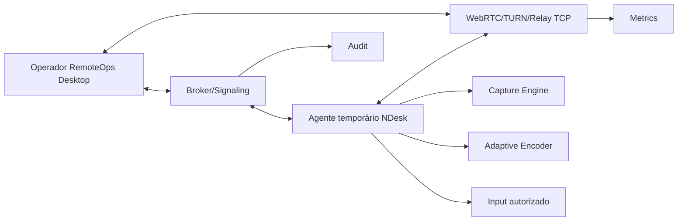

# 09 — Módulo NDesk: assistência remota consentida

## Objetivo

Criar um módulo de assistência remota interno, semelhante ao fluxo de TeamViewer/AnyDesk, mas controlado pela empresa, com broker próprio, links temporários, consentimento explícito, bom desempenho em conexão lenta, funcionamento atrás de NAT/CGNAT e agente temporário leve para Windows.

## Princípio de segurança

O NDesk só deve funcionar com autorização clara do usuário assistido. Não deve haver modo oculto, controle sem consentimento, persistência silenciosa, captura de credenciais ou bypass de controles do Windows.

## Decisão importante

O viewer do operador fica dentro do RemoteOps Desktop. O agente baixado pelo usuário atendido deve ser um componente separado, preferencialmente **Win32/C++ nativo**, sem exigir Java, WebView2 ou .NET moderno. Isso é necessário para atendimento esporádico em máquinas antigas, incluindo Windows 7 SP1.

Detalhes de performance, Windows legado e NAT estão em `docs/22-ndesk-performance-legacy-windows.md`.

## Fases do NDesk

### Fase 1 — MVP controlado

- Operador cria convite temporário.
- Cliente baixa agente temporário assinado.
- Agente mostra consentimento.
- Usuário escolhe modo básico ou controle.
- Visualização de tela.
- Controle remoto opcional, autorizado separadamente.
- Encerrar sessão por qualquer lado.
- Auditoria básica.
- Relay próprio para conexões onde P2P não funciona.

### Fase 2 — Robustez

- NAT traversal com STUN/TURN/relay próprio.
- Fallback TCP/TLS 443 para redes restritivas.
- Transferência de arquivo com permissão separada.
- Chat.
- Gravação opcional com política.
- Reconexão controlada.
- Modo instalado para máquinas internas, sempre visível e governado.
- Perfis de baixa banda.

### Fase 3 — Operação avançada

- Fila de atendimento.
- Agrupamento por cliente.
- Relatórios.
- Integração ITSM.
- Políticas por tenant.
- Modo administrador consentido com helper temporário assinado.

## Arquitetura

## Componentes

### Broker/Signaling

- Cria convites.
- Valida tokens.
- Faz pareamento operador/agente.
- Troca mensagens de signaling.
- Expira sessões.
- Publica eventos de auditoria.
- Entrega configuração de relay e perfil de qualidade.

### Agente temporário

- Binário Windows assinado.
- Pode ser single-file.
- Não instala serviço no MVP.
- Não exige Java.
- Não exige WebView2.
- Não exige .NET moderno.
- Mostra tela de consentimento.
- Mostra banner durante sessão.
- Expira após uso ou tempo.
- Remove artefatos temporários quando terminar.

### Viewer/Operator

- Integrado ao RemoteOps Desktop.
- Mostra status do cliente.
- Solicita permissões.
- Exibe tela remota.
- Envia input apenas após autorização.
- Mostra qualidade de conexão, RTT, perda, FPS e rota.

### Relay

- Necessário quando conexão direta falhar.
- Pode ser WebRTC TURN ou relay próprio.
- Deve suportar IPv4 e IPv6.
- Deve autenticar sessões e limitar banda.
- Deve operar via TCP/TLS 443 como fallback.

## Pipeline de mídia

Caminho recomendado:

- Captura Windows 10/11: Windows.Graphics.Capture ou DXGI Desktop Duplication.
- Captura Windows 7: GDI BitBlt com dirty-region no MVP legado; DXGI com Platform Update apenas após spike.
- Codec: H.264/OpenH264, VP8 ou codec validado no spike.
- Transporte moderno: WebRTC.
- Transporte legado: relay TCP/TLS 443 com protocolo próprio.
- Canal de controle: DataChannel ou canal TLS separado.
- Input: API Windows autorizada, com bloqueios para teclas sensíveis conforme política.

## Consentimento e UX

Permissões separadas:

- Visualizar tela.
- Controlar mouse/teclado.
- Transferir arquivo.
- Elevar permissões/ações administrativas, quando aplicável.

Tela do cliente deve mostrar:

- Nome do operador.
- Nome da empresa.
- Permissões solicitadas.
- Código/ticket.
- Modo solicitado: básico, controle, arquivo ou administrador.
- Botão negar.
- Botão encerrar.

## Permissão básica vs administrador

### Permissão básica

- Visualização e, se autorizado, controle no contexto do usuário atual.
- Não interage com UAC Secure Desktop.
- Não instala serviço.
- Ideal para atendimento rápido.

### Permissão administrador

- Exige consentimento separado.
- Pode exigir execução elevada ou helper temporário assinado.
- Deve respeitar UAC.
- Não deve capturar senha digitada no UAC.
- Deve exibir indicador visual permanente.
- Deve remover helper temporário ao final, salvo instalação persistente governada e explícita.

## Limitações esperadas

- UAC Secure Desktop pode bloquear controle em prompts elevados sem helper autorizado.
- Captura de tela pode ter restrições por política Windows.
- Baixa latência exige tuning de codec e rede.
- Antivírus pode alertar em ferramentas de acesso remoto; assinatura e transparência são essenciais.
- Implementar WebRTC nativo pode ser complexo; validar biblioteca no spike.
- Windows 7 é legado e pode ter performance inferior por captura, driver e CPU.

## Auditoria NDesk

Eventos obrigatórios:

- Convite criado.
- Convite copiado/enviado.
- Agente baixado/iniciado.
- Consentimento concedido/negado.
- Visualização iniciada/finalizada.
- Controle concedido/revogado.
- Transferência iniciada/finalizada.
- Modo administrador solicitado/concedido/negado.
- Relay usado.
- Rota direta usada.
- Sessão encerrada.
- Erro de conexão/relay.

## Critérios de aceite MVP

- Operador cria link com expiração.
- Agente temporário conecta ao broker.
- Usuário autoriza visualização.
- Operador vê tela remota.
- Usuário autoriza controle separadamente.
- Usuário consegue encerrar imediatamente.
- Sessão gera audit log.
- Agente não fica persistente sem instalação explícita.
- Agente roda em Windows 10 sem runtime adicional.
- Agente roda em Windows 7 SP1 de laboratório sem Java/WebView2/.NET moderno.
- Sessão via relay funciona atrás de NAT/CGNAT.
- Link degradado de baixa banda mantém controle utilizável com qualidade reduzida.
