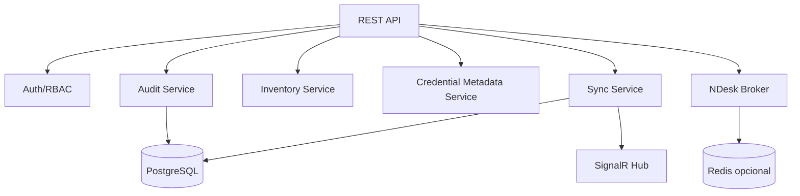

# 10 — Backend cloud, sync e broker

> **Estado atual (feature/cloud-backend):** EF Core + Npgsql, JWT Bearer, SignalR e endpoints auth/sync implementados em `src/RemoteOps.Cloud`. Ver `adr/ADR-008-backend-ef-npgsql-signalr.md` e `CHANGELOG.md [0.7.0-cloud-backend]` para detalhes de implementação.

## Configuração obrigatória (variáveis de ambiente)

| Variável | Descrição |
|---|---|
| `REMOTEOPS_DB_CONNECTION` | Connection string PostgreSQL. Nunca em appsettings. Alias legado: `ConnectionStrings__Default` (tem precedência se os dois existirem). |
| `Jwt__SecretKeyBase64` | Chave HMAC-SHA256 em base64, ≥ 32 bytes decodificados (`openssl rand -base64 32`). Nunca commitada. |
| `Jwt__SigningKey` | Forma legada da chave acima (texto puro, UTF-8). Vale se `Jwt__SecretKeyBase64` não estiver definida. |
| `Jwt__Issuer` | Issuer do JWT (ex.: `remoteops-cloud`). Pode estar em appsettings. |
| `Jwt__Audience` | Audience do JWT (ex.: `remoteops-desktop`). Pode estar em appsettings. |
| `Auth__KdfDecoyKeyBase64` | Opcional. Chave do decoy anti-enumeração do `/auth/kdf`. Ausente = derivada da chave do JWT via HKDF. |

Resolução centralizada em `Configuration/DeploymentConfig.cs` — falha no startup
(não no primeiro login) quando falta config ou a chave é curta demais.

## Deploy

Migrations EF aplicadas no startup (`DatabaseBootstrapper`); imagem e stack em
`Dockerfile` + `docker-compose.yml` (API + Postgres + Caddy/TLS). Passo a passo do
operador: **`docs/runbook-deploy-debian.md`**.


## Objetivo

Fornecer backend central para autenticação, multiusuário, sincronização, auditoria e broker de assistência remota.

## Stack recomendada

- ASP.NET Core.
- PostgreSQL.
- SignalR/WebSocket.
- Redis opcional para cache, pub/sub e sessões efêmeras.
- OpenTelemetry.
- Docker para dev e produção.
- Reverse proxy: Caddy, Nginx ou Traefik.
- TLS obrigatório.

## Serviços lógicos



## APIs principais

### Auth

- `POST /auth/login`
- `POST /auth/refresh`
- `POST /auth/logout`
- `POST /devices/register`
- `POST /devices/revoke`

### Sync

- `GET /sync/pull?workspaceId=&cursor=`
- `POST /sync/push`
- `GET /sync/conflicts`
- `POST /sync/conflicts/{id}/resolve`

### Inventory

- `GET /workspaces/{id}/assets`
- `POST /workspaces/{id}/assets`
- `PUT /assets/{id}`
- `DELETE /assets/{id}`

### Credentials

- `POST /credentials`
- `PUT /credentials/{id}/metadata`
- `POST /credentials/{id}/rotate`
- `POST /credentials/{id}/grant`
- `POST /credentials/{id}/revoke`

### NDesk

- `POST /ndesk/tickets`
- `GET /ndesk/tickets/{id}`
- `POST /ndesk/tickets/{id}/expire`
- `POST /ndesk/signal`
- `GET /ndesk/ws`

## Modelo de autorização

Toda request deve carregar:

- Usuário autenticado.
- Device ID.
- Workspace/Tenant.
- Correlation ID.

Verificações:

- Usuário ativo.
- Dispositivo autorizado.
- Role permite ação.
- Política do grupo/host permite protocolo.
- Ação sensível requer aprovação se configurado.

## Sync em tempo real

SignalR envia apenas hints. Exemplo:

```json
{
  "event": "workspace.changed",
  "workspaceId": "01HX...",
  "cursor": 98123,
  "entityType": "asset",
  "entityId": "01HY..."
}
```

## NDesk broker

Responsabilidades:

- Gerar token curto de convite.
- Validar operador e agente.
- Controlar expiração.
- Trocar mensagens de signaling.
- Encaminhar mensagens para relay quando necessário.
- Registrar auditoria.

## Produção self-host

### Servidor mínimo

- VM Linux com IPv4 público e IPv6 público.
- Docker/Compose.
- PostgreSQL com backup.
- TLS via ACME.
- Firewall liberando apenas portas necessárias.
- Monitoramento e logs.

### Portas sugeridas

- 443/tcp: API, SignalR e signaling.
- 3478/udp/tcp: TURN/relay se adotado.
- 5349/tcp: TURN TLS se adotado.

## Backup

- Backup diário PostgreSQL.
- Backup de configuração do servidor.
- Backup separado de chaves de recuperação, com procedimento manual e auditável.
- Teste periódico de restore.

## Observabilidade

- Correlation ID em todas as requests.
- Métricas: latency, error rate, sync lag, active sessions.
- Logs estruturados sem segredos.
- Alertas: erro de sync, falha de login repetida, alteração de credencial, falha NDesk.
