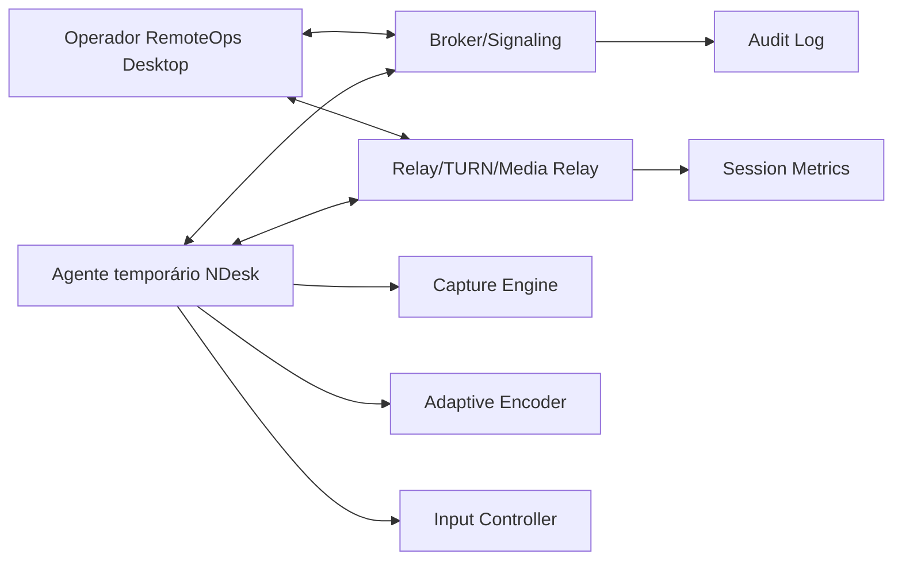

# 22 — NDesk: performance, NAT e Windows antigo

## Objetivo

Definir uma arquitetura de acesso remoto que funcione bem em conexão lenta, através de NAT/CGNAT/firewall, e com agente temporário leve para Windows 10 e Windows 7, sem Java, sem WebView2 e sem exigir instalação de .NET moderno na máquina atendida.

## Princípios

- A sessão só começa com consentimento explícito.
- O usuário atendido escolhe o nível de permissão.
- O operador não deve conseguir burlar UAC, antivírus, EDR ou políticas do Windows.
- O agente temporário não deve criar persistência silenciosa.
- A performance deve ser melhor que VNC clássico: codec adaptativo, regiões alteradas, cursor separado e transporte otimizado.
- O produto deve aceitar relay próprio para evitar bloqueio/comercialização abusiva de terceiros.

## Plataformas alvo

| Plataforma | Status | Estratégia |
|---|---|---|
| Windows 11 | Principal | captura moderna, codec adaptativo, WebRTC/relay |
| Windows 10 | Principal | captura moderna quando disponível, fallback DXGI/GDI |
| Windows 8.1 | Secundário opcional | DXGI Desktop Duplication se mantido no escopo |
| Windows 7 SP1 | Legado | agente Win32 nativo, GDI/BitBlt ou caminho DXGI com Platform Update quando validado, sem WebView2/.NET moderno |

Windows 7 deve ser suportado como necessidade operacional, mas marcado como legado e com risco de segurança. O projeto não deve prometer a mesma performance de Windows 10/11 em todas as máquinas antigas.

## Arquitetura de alto nível

## Componentes

### Broker/Signaling

- Emite convites temporários.
- Gera token curto, escopado e revogável.
- Pareia operador e agente.
- Troca candidatos ICE/STUN/TURN quando WebRTC estiver disponível.
- Encaminha fallback para relay TCP/TLS quando necessário.
- Controla expiração, revogação e auditoria.

### Relay/TURN/Media Relay

- Deve rodar em servidor próprio da empresa.
- Deve aceitar IPv4 e IPv6.
- Deve operar em portas amigáveis a firewall, por exemplo TCP 443/TLS como fallback.
- Deve medir perda, RTT, bitrate, jitter, FPS, codec, resolução e tipo de rota: direta, TURN, relay TCP.
- Deve aplicar rate limit por tenant, operador e sessão.

### Agente temporário

- Binário assinado.
- Idealmente single-file.
- Runtime C/C++ estático quando possível.
- Não exige Java.
- Não exige WebView2.
- Não exige .NET moderno.
- Exibe janela de consentimento e banner permanente durante sessão.
- Encerra e limpa arquivos temporários ao final.
- Pode oferecer instalação de serviço apenas em modo explícito, com consentimento e política.

### Viewer do operador

- Integrado ao RemoteOps Desktop.
- Recebe stream adaptativo.
- Mostra qualidade da rota e modo de permissão.
- Solicita controle, arquivo ou admin separadamente.
- Mostra claramente quando está em relay e quando está em conexão direta.

## Permissões do usuário atendido

### Básico

- Visualização de tela.
- Chat.
- Sem controle de mouse/teclado.
- Sem transferência de arquivo.
- Sem elevação.

### Controle

- Visualização.
- Mouse e teclado.
- Bloqueio de combinações sensíveis conforme política.
- Usuário pode pausar ou revogar controle imediatamente.

### Arquivo

- Transferência de arquivo separada do controle.
- Exige confirmação própria.
- Deve registrar nome, tamanho, hash e direção, sem armazenar conteúdo no log.

### Administrador

- Exige consentimento separado.
- Pode exigir que o usuário execute o agente como administrador ou aceite UAC.
- Para interagir com prompts elevados, o projeto deve usar caminho autorizado e visível, como helper/service instalado temporariamente com consentimento.
- Sem bypass de UAC, sem captura oculta de credenciais e sem tentativa de enganar o Secure Desktop.

## UAC e elevação

Fluxo recomendado:

1. Operador solicita `Permissão administrativa`.
2. Agente mostra explicação clara ao usuário.
3. Usuário aceita.
4. Windows exibe UAC quando necessário.
5. Se o usuário aprovar, o agente passa para modo elevado ou instala helper temporário aprovado.
6. UI exibe badge `Modo administrador`.
7. Usuário pode encerrar a sessão a qualquer momento.
8. Helper temporário é removido ao final, salvo se a política de instalação persistente for explicitamente aprovada por administrador interno.

## Performance em conexão lenta

O NDesk não deve enviar framebuffer bruto. Estratégia:

- detecção de regiões alteradas;
- cursor enviado separadamente;
- redução dinâmica de FPS;
- redução dinâmica de resolução;
- adaptação de bitrate;
- opção `Texto/baixa banda` para priorizar legibilidade;
- compressão intra-frame para telas estáticas;
- keyframes controlados;
- desduplicação de frames quando a tela não muda;
- fila curta para evitar atraso acumulado;
- priorização de input sobre vídeo;
- backpressure para não saturar upload fraco;
- modo `somente visualização` mais econômico.

## Perfis de qualidade

### Automático

Ajusta resolução, FPS e bitrate com base em RTT, perda e throughput.

### Baixa banda

- 5 a 10 FPS.
- Resolução reduzida.
- Foco em texto legível.
- Animações e wallpapers podem ser sugeridos como desligados.

### Balanceado

- 15 a 30 FPS quando possível.
- Boa resposta de mouse/teclado.

### Qualidade alta

- Usar apenas em LAN ou link bom.
- Maior uso de CPU/banda.

## Captura de tela por versão

### Windows 10/11

- Preferir Windows.Graphics.Capture quando disponível.
- Alternativa: DXGI Desktop Duplication.
- Fallback: GDI BitBlt para casos problemáticos.

### Windows 8/8.1

- Preferir DXGI Desktop Duplication.
- Fallback: GDI BitBlt.

### Windows 7 SP1

- Começar com GDI BitBlt e detecção de regiões alteradas.
- Validar DXGI com Platform Update em spike separado.
- Evitar driver/mirror driver no MVP para não exigir instalação administrativa complexa.
- Aceitar que performance pode variar por CPU/GPU/driver.

## Transporte

### Caminho principal

- WebRTC com ICE, STUN e TURN/relay próprio para Windows 10/11.

### Fallback legado

- Relay TCP/TLS 443 com protocolo próprio simples para Windows 7.
- UDP hole punching pode ser pesquisado, mas não deve ser requisito do MVP legado.
- O fallback deve priorizar confiabilidade e baixa latência percebida, mesmo com qualidade visual menor.

## Telemetria obrigatória

Por sessão:

- RTT médio/p95;
- perda de pacotes;
- bitrate enviado/recebido;
- FPS capturado e FPS entregue;
- resolução efetiva;
- codec;
- CPU do agente;
- memória do agente;
- rota: direta, TURN, relay TCP;
- queda/reconexão;
- motivo de encerramento.

Sem capturar conteúdo de tela no log.

## Segurança e abuso

- Convite expira.
- Token é uso único.
- Sessão vinculada a operador autenticado.
- Usuário atendido vê nome do operador e empresa.
- Sem modo invisível.
- Sem instalação persistente no MVP.
- Qualquer modo instalado deve ser governado por política, visível e auditado.
- Downloads do agente devem ser assinados e servidos por HTTPS.
- Rate limit para evitar abuso.

## Critérios de aceite MVP NDesk

- Gerar link temporário.
- Baixar agente assinado.
- Rodar agente em Windows 10 sem instalar runtime adicional.
- Rodar agente em Windows 7 SP1 de laboratório sem Java/WebView2/.NET moderno.
- Mostrar consentimento com permissões separadas.
- Visualização funcional em link com 2 Mbps de upload e 80 ms RTT.
- Controle opcional separado da visualização.
- Relay funcionando atrás de NAT/CGNAT.
- Usuário consegue encerrar imediatamente.
- Métricas básicas são registradas.
- Nenhuma senha, imagem de tela ou conteúdo de arquivo aparece em log.

## Spikes obrigatórios

1. Captura Win7: GDI BitBlt com dirty-region e compressão.
2. Captura Win10: Windows.Graphics.Capture vs DXGI.
3. Codec: H.264/OpenH264, VP8 ou alternativa leve.
4. Transporte: WebRTC nativo vs relay TCP/TLS legado.
5. UAC/admin: helper temporário visível e removível.
6. Antivírus/EDR: assinatura, reputação e comportamento transparente.
7. Teste de conexão lenta: 1 Mbps, 2 Mbps, 5 Mbps, perda 1%, 3%, 5%.

## Fronteiras para agentes

### NDesk Agent

Implementa agente temporário, captura, codec, input e UI de consentimento.

### Cloud Sync/Backend Agent

Implementa broker, convite, token, sessão e signaling.

### Security Agent

Revisa consentimento, elevação, logs, assinatura e abuso.

### QA Agent

Monta laboratório Windows 7/10/11, NAT/CGNAT simulado e links degradados.

### DevOps Agent

Cria pipeline de build assinado do agente e release separado do Desktop.
