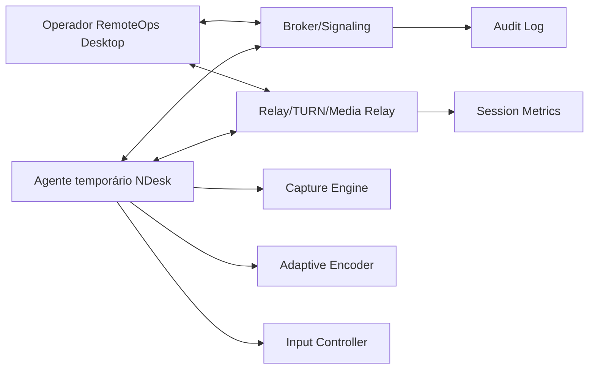

# 22 — NDesk: performance, NAT e plataformas suportadas

> **Nota (`ADR-016`):** este documento foi revisto para remover Windows 7/8/8.1 do escopo do NDesk. O título e o conteúdo original tratavam "Windows antigo" como requisito de primeira classe (incluindo Windows 7 SP1); essa premissa foi revertida — ver `adr/ADR-016-ndesk-pivo-win10-net.md`. O histórico de decisão anterior permanece rastreável em `adr/ADR-007-ndesk-agente-legado-win32.md` (superada) e `docs/spikes/SPIKE-016-ndesk-buy-vs-build.md`.

## Objetivo

Definir uma arquitetura de acesso remoto que funcione bem em conexão lenta, através de NAT/CGNAT/firewall, e com agente temporário leve para Windows 10 e Windows 11, sem Java e sem WebView2. O agente é publicado como .NET moderno single-file self-contained, sem exigir instalação de runtime na máquina atendida (`ADR-016`). Roadmap futuro (não comprometido neste documento) prevê portabilidade para Linux e macOS.

## Princípios

- A sessão só começa com consentimento explícito.
- O usuário atendido escolhe o nível de permissão.
- O operador não deve conseguir burlar UAC, antivírus, EDR ou políticas do Windows.
- O agente temporário não deve criar persistência silenciosa.
- A performance deve ser melhor que VNC clássico: codec adaptativo, regiões alteradas, cursor separado e transporte otimizado.
- O produto deve aceitar relay próprio para evitar bloqueio/comercialização abusiva de terceiros.

## Plataformas alvo

| Plataforma | Status | Estratégia |
|---|---|---|
| Windows 11 | Principal | DXGI Desktop Duplication, codec adaptativo, WebRTC/relay |
| Windows 10 (21H2+) | Principal | DXGI Desktop Duplication, codec adaptativo, WebRTC/relay |

Windows 7, Windows 8 e Windows 8.1 estão **fora de escopo** do NDesk por decisão de produto (`ADR-016`, que supera `ADR-007`). Essa remoção não é apenas uma simplificação de matriz: ela elimina o único motivo técnico para o agente ser Win32/C++ nativo, permitindo o pivô para .NET moderno self-contained (ver "Componentes > Agente temporário" abaixo).

**Roadmap futuro (não comprometido neste documento):** captura e input ficam atrás de uma interface (`IScreenCaptureProvider`/`IInputInjector`) para permitir, quando priorizado, implementações equivalentes em Linux (PipeWire) e macOS (`CGDisplayStream`) sem reabrir a arquitetura do agente.

## Arquitetura de alto nível

## Componentes

### Broker/Signaling

- Emite convites temporários.
- Gera token curto, escopado e revogável.
- Pareia operador e agente.
- Troca candidatos ICE/STUN/TURN quando WebRTC estiver disponível.
- Encaminha fallback para relay TCP/TLS quando necessário.
- Controla expiração, revogação e auditoria.

**Status:** implementado em `src/RemoteOps.NDesk.Broker` (ver `adr/ADR-018-ndesk-signaling-api.md`)
para a parte de tickets/consentimento/signaling opaco (SDP/ICE) e telemetria/auditoria. Troca de
candidatos ICE/STUN/TURN reais depende do agente/viewer (pendentes) — o broker só repassa o
envelope, não interpreta.

### Relay/TURN/Media Relay

- Deve rodar em servidor próprio da empresa.
- Deve aceitar IPv4 e IPv6.
- Deve operar em portas amigáveis a firewall, por exemplo TCP 443/TLS como fallback.
- Deve medir perda, RTT, bitrate, jitter, FPS, codec, resolução e tipo de rota: direta, TURN, relay TCP.
- Deve aplicar rate limit por tenant, operador e sessão.

### Agente temporário

- Binário assinado.
- .NET moderno, publicado single-file self-contained (`ADR-016`) — sem exigir instalação de runtime .NET na máquina atendida.
- Não exige Java.
- Não exige WebView2.
- Exibe janela de consentimento e banner permanente durante sessão.
- Encerra e limpa arquivos temporários ao final.
- Pode oferecer instalação de serviço apenas em modo explícito, com consentimento e política.

### Viewer do operador

- Integrado ao RemoteOps Desktop.
- Recebe stream adaptativo.
- Mostra qualidade da rota e modo de permissão.
- Solicita controle, arquivo ou admin separadamente.
- Mostra claramente quando está em relay e quando está em conexão direta.

## Permissões do usuário atendido

### Básico

- Visualização de tela.
- Chat.
- Sem controle de mouse/teclado.
- Sem transferência de arquivo.
- Sem elevação.

### Controle

- Visualização.
- Mouse e teclado.
- Bloqueio de combinações sensíveis conforme política.
- Usuário pode pausar ou revogar controle imediatamente.

### Arquivo

- Transferência de arquivo separada do controle.
- Exige confirmação própria.
- Deve registrar nome, tamanho, hash e direção, sem armazenar conteúdo no log.

### Administrador

- Exige consentimento separado.
- Pode exigir que o usuário execute o agente como administrador ou aceite UAC.
- Para interagir com prompts elevados, o projeto deve usar caminho autorizado e visível, como helper/service instalado temporariamente com consentimento.
- Sem bypass de UAC, sem captura oculta de credenciais e sem tentativa de enganar o Secure Desktop.

## UAC e elevação

Fluxo recomendado:

1. Operador solicita `Permissão administrativa`.
2. Agente mostra explicação clara ao usuário.
3. Usuário aceita.
4. Windows exibe UAC quando necessário.
5. Se o usuário aprovar, o agente passa para modo elevado ou instala helper temporário aprovado.
6. UI exibe badge `Modo administrador`.
7. Usuário pode encerrar a sessão a qualquer momento.
8. Helper temporário é removido ao final, salvo se a política de instalação persistente for explicitamente aprovada por administrador interno.

## Performance em conexão lenta

O NDesk não deve enviar framebuffer bruto. Estratégia:

- detecção de regiões alteradas;
- cursor enviado separadamente;
- redução dinâmica de FPS;
- redução dinâmica de resolução;
- adaptação de bitrate;
- opção `Texto/baixa banda` para priorizar legibilidade;
- compressão intra-frame para telas estáticas;
- keyframes controlados;
- desduplicação de frames quando a tela não muda;
- fila curta para evitar atraso acumulado;
- priorização de input sobre vídeo;
- backpressure para não saturar upload fraco;
- modo `somente visualização` mais econômico.

## Perfis de qualidade

### Automático

Ajusta resolução, FPS e bitrate com base em RTT, perda e throughput.

### Baixa banda

- 5 a 10 FPS.
- Resolução reduzida.
- Foco em texto legível.
- Animações e wallpapers podem ser sugeridos como desligados.

### Balanceado

- 15 a 30 FPS quando possível.
- Boa resposta de mouse/teclado.

### Qualidade alta

- Usar apenas em LAN ou link bom.
- Maior uso de CPU/banda.

## Captura de tela — Windows 10/11

- Caminho primário: **DXGI Desktop Duplication**.
- Fallback: GDI BitBlt para casos problemáticos (ex.: sessões RDP/console sem suporte a duplicação, apps com proteção DRM que bloqueiam DXGI).
- Captura fica atrás de uma interface (`IScreenCaptureProvider`) para permitir, no roadmap futuro, uma implementação equivalente em Linux (PipeWire) e macOS (`CGDisplayStream`) — ver `ADR-016`. Esta seção substitui a antiga matriz por versão (Windows 10/11 vs 8/8.1 vs 7 SP1), revista pela `ADR-016`.

## Transporte

### Caminho principal

- WebRTC com ICE, STUN e TURN/relay próprio.
- Escolha final entre stack WebRTC nativa (`libwebrtc`/`libdatachannel`, acessada via interop) e stack C# gerenciada fica para `SPIKE-017`/`ADR-017` (ver `adr/ADR-005-acesso-remoto-webrtc.md`, seção "Atualização (ADR-016)").

### Fallback para redes restritivas

- Relay TCP/TLS 443 com protocolo próprio simples, para redes onde WebRTC/UDP é bloqueado por firewall corporativo.
- UDP hole punching pode ser pesquisado, mas não deve ser requisito do MVP.
- O fallback deve priorizar confiabilidade e baixa latência percebida, mesmo com qualidade visual menor.

## Telemetria obrigatória

Por sessão:

- RTT médio/p95;
- perda de pacotes;
- bitrate enviado/recebido;
- FPS capturado e FPS entregue;
- resolução efetiva;
- codec;
- CPU do agente;
- memória do agente;
- rota: direta, TURN, relay TCP;
- queda/reconexão;
- motivo de encerramento.

Sem capturar conteúdo de tela no log.

**Status:** captura/persistência das amostras acima implementada no broker
(`NDeskTelemetryService`, `POST /ndesk/sessions/{sessionId}/telemetry`); emissão das amostras
pelo agente/viewer ainda pendente.

## Segurança e abuso

- Convite expira.
- Token é uso único.
- Sessão vinculada a operador autenticado.
- Usuário atendido vê nome do operador e empresa.
- Sem modo invisível.
- Sem instalação persistente no MVP.
- Qualquer modo instalado deve ser governado por política, visível e auditado.
- Downloads do agente devem ser assinados e servidos por HTTPS.
- Rate limit para evitar abuso.

## Critérios de aceite MVP NDesk

- Gerar link temporário.
- Baixar agente assinado.
- Rodar agente em Windows 10 (21H2+) e Windows 11 sem instalar runtime adicional (publish .NET self-contained).
- Mostrar consentimento com permissões separadas.
- Visualização funcional em link com 2 Mbps de upload e 80 ms RTT.
- Controle opcional separado da visualização.
- Relay funcionando atrás de NAT/CGNAT.
- Usuário consegue encerrar imediatamente.
- Métricas básicas são registradas.
- Nenhuma senha, imagem de tela ou conteúdo de arquivo aparece em log.

## Spikes obrigatórios

1. Captura Windows 10/11: DXGI Desktop Duplication, incluindo fallback GDI BitBlt.
2. Codec: H.264/OpenH264, VP8 ou alternativa leve.
3. Transporte (`SPIKE-017`): WebRTC nativo (`libwebrtc`/`libdatachannel`) vs stack C# gerenciada, mais fallback relay TCP/TLS para redes restritivas.
4. UAC/admin: helper temporário visível e removível.
5. Antivírus/EDR: assinatura, reputação e comportamento transparente — inclui revalidação do perfil de detecção do binário .NET self-contained (`ADR-016`).
6. Teste de conexão lenta: 1 Mbps, 2 Mbps, 5 Mbps, perda 1%, 3%, 5%.

> Nota: o spike de captura Windows 7 (GDI BitBlt legado) previsto anteriormente nesta lista, e o `SPIKE-011` correspondente em `docs/15-pesquisa-e-spikes.md`, ficam órfãos após `ADR-016` remover Windows 7 do escopo. A descontinuação/reformulação formal de `docs/15` fica para uma atualização futura, fora do escopo desta revisão.

## Fronteiras para agentes

### NDesk Agent

Implementa agente temporário, captura, codec, input e UI de consentimento.

### Cloud Sync/Backend Agent

Implementa broker, convite, token, sessão e signaling.

### Security Agent

Revisa consentimento, elevação, logs, assinatura e abuso.

### QA Agent

Monta laboratório Windows 10/11, NAT/CGNAT simulado e links degradados.

### DevOps Agent

Cria pipeline de build assinado do agente e release separado do Desktop.
